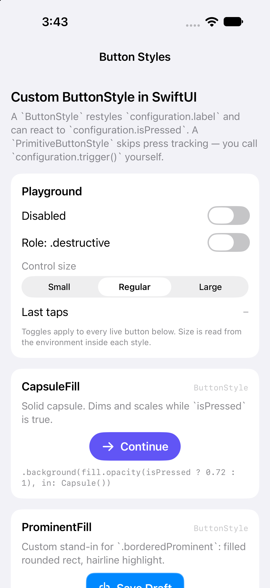
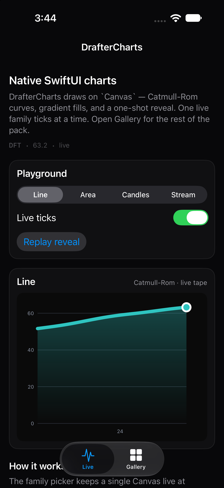
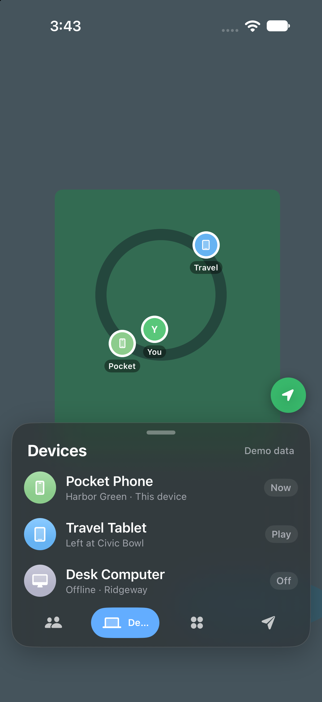
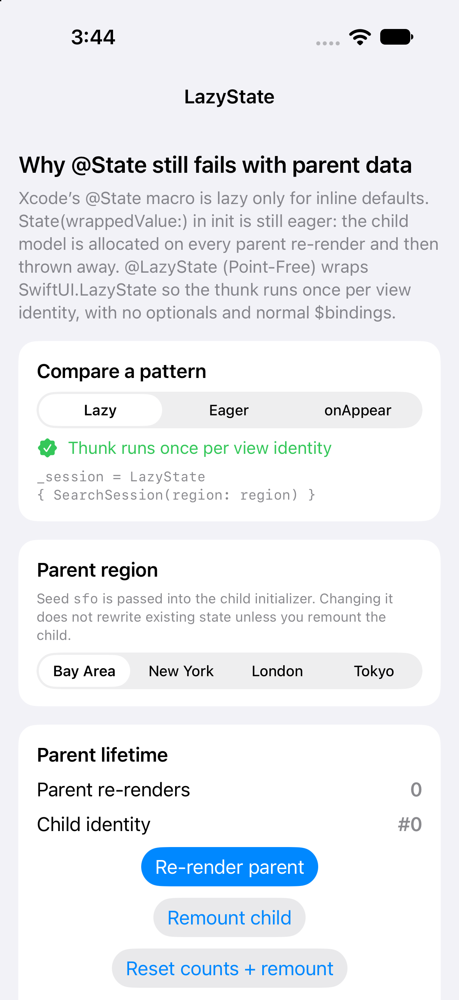
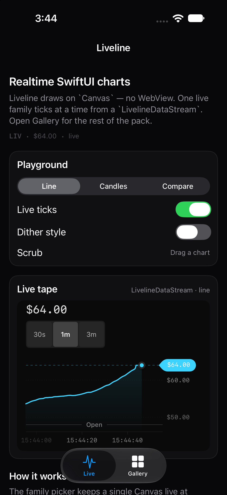
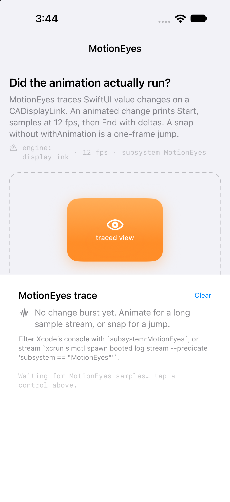
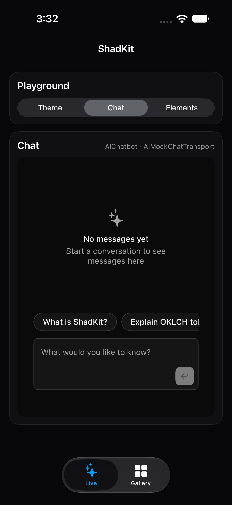
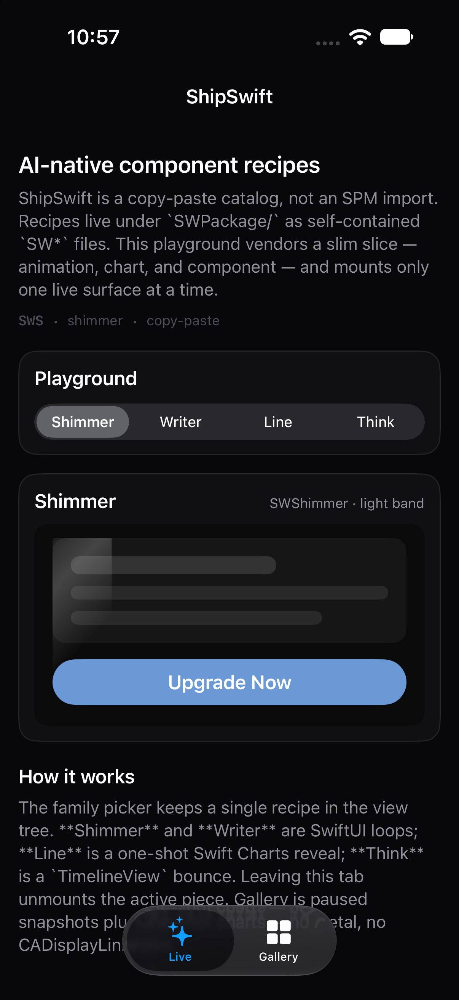
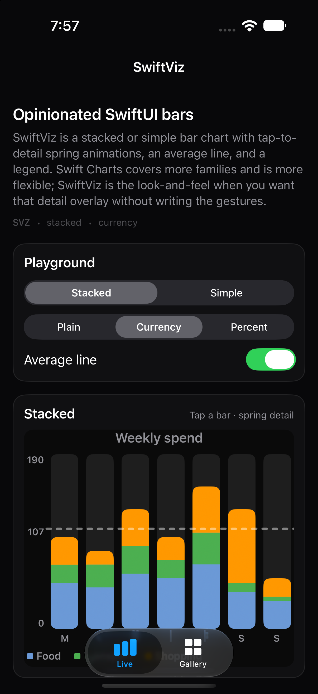

# tech-demos-monorepo

Sticky monorepo for iOS / SwiftUI demos.

Each demo lives under `apps/<kebab-slug>/`.

## Demos

### [Button Styles](apps/button-styles/)

Custom `ButtonStyle` / `PrimitiveButtonStyle` gallery.

### [Drafter Charts](apps/drafter-charts/)

[DrafterCharts](https://github.com/AndroidPoet/DrafterCharts) Live + Gallery playground.

### [Find My Tab Bar](apps/find-my-tab-bar/)

Floating morphing tab bar inspired by Find My.

### [Lazy State](apps/lazy-state/)

Lazy `@State` initialized from parent data.

### [Liveline](apps/liveline/)

[Liveline](https://github.com/ParthJadhav/liveline-swift) realtime charts playground.

### [Motion Eyes](apps/motion-eyes/)

SwiftUI playground that integrates [MotionEyes](https://github.com/edwardsanchez/MotionEyes) so CADisplayLink traces show whether animations actually ran.

### [Shad Kit](apps/shad-kit/)

[ShadKit](https://github.com/jasonkneen/ShadKit) shadcn/ui + AI Elements playground (Live + Gallery).

### [Ship Swift](apps/ship-swift/)

Slim [ShipSwift](https://github.com/signerlabs/ShipSwift) copy-paste playground (`SWPackage` recipes, Live + Gallery).

### [Swift Viz](apps/swift-viz/)

[SwiftViz](https://github.com/omarsinan/SwiftViz) stacked / simple bar charts.

## Notes

- Prefer Mac/iOS builds with Xcode + Simulator when a pool is available.
- Demo PRs should include at least one simulator screenshot and one video.
